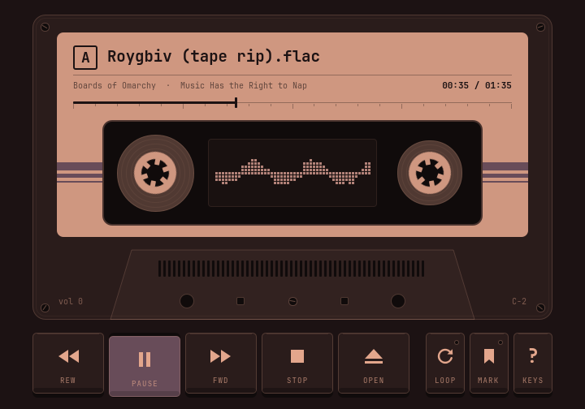
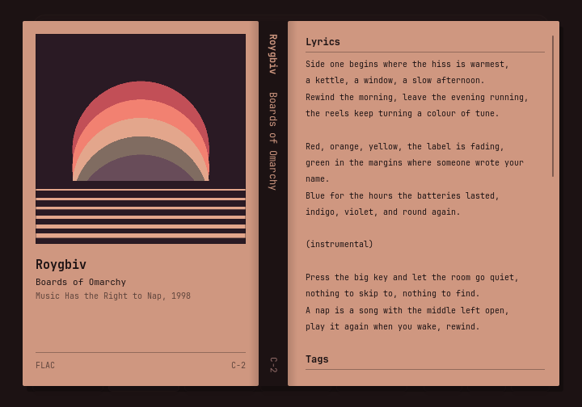
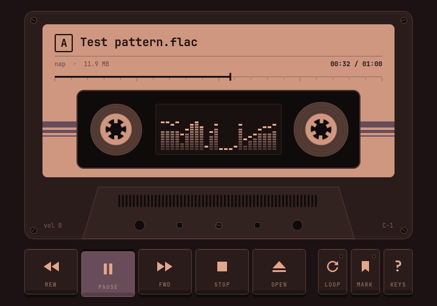
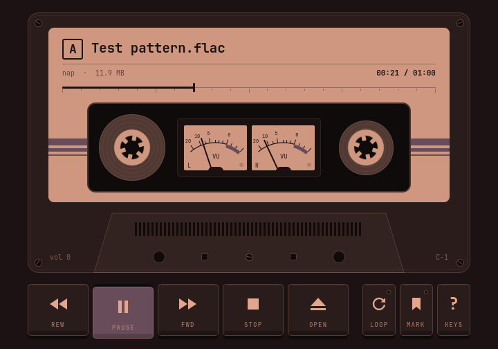
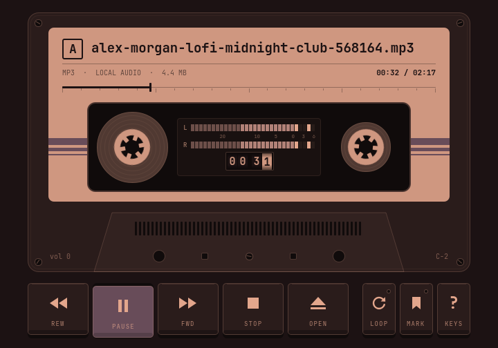
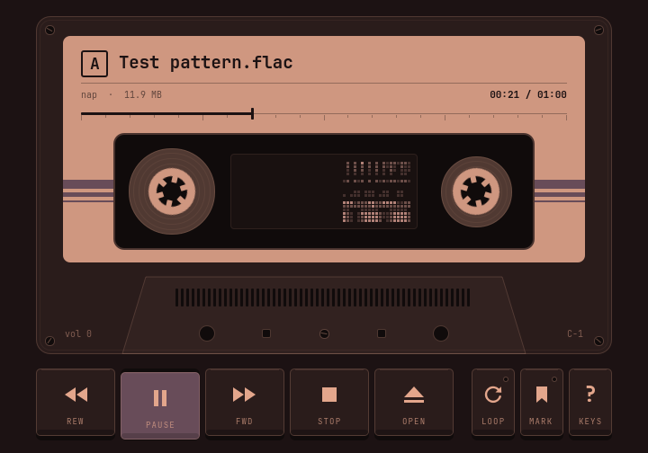
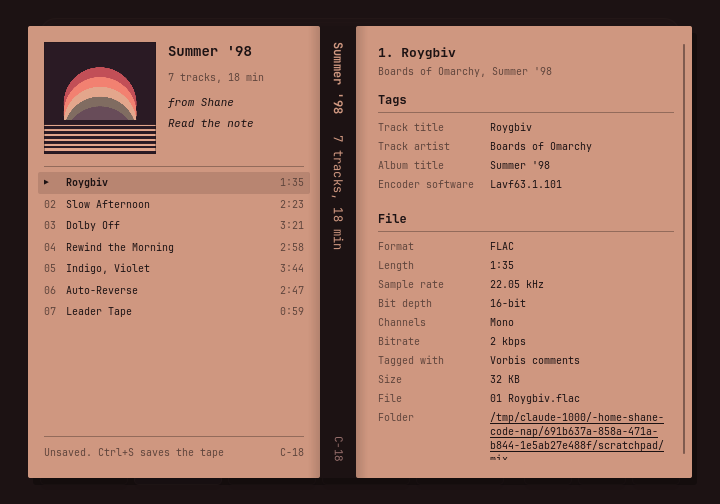
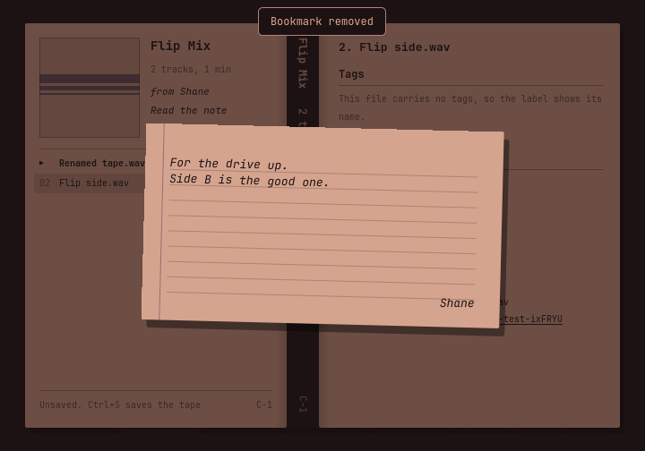

# nap — Nice Audio Player

A little cassette deck for your desktop. One file, a paper label, two moving
reels, and a live waveform behind the plastic window. Made for the same quiet,
keyboard-first desktop as npr and nvp.





| bars | vu |
| --- | --- |
|  |  |
| **peak** | **spectrogram** |
|  |  |

## Build and run

Requires Linux, a Rust toolchain, a C++17 compiler, Make, pkg-config, and Qt **6.8 or later** with Quick,
Quick Controls, Dialogs, and the FFmpeg Multimedia backend. On Arch the relevant
Qt packages are `qt6-base`, `qt6-declarative`, `qt6-multimedia`, and
`qt6-multimedia-ffmpeg`. Tests also use Python 3 and Qt Test. `make install` uses `xdg-mime`
(xdg-utils) and `update-mime-database` (shared-mime-info).

```sh
make
./target/release/nap                         # empty deck; open or drop a file
./target/release/nap ~/Music/song.flac
./target/release/nap side-a/*.flac            # several files line up as one tape
./target/release/nap "Summer '98.tape"         # or a saved mixtape, or its .jcard
./target/release/nap --paused --time 1:02.5 song.mp3
./target/release/nap --volume 40 --loop song.ogg
./target/release/nap --ignore-bookmark song.wav
make test
```

`--time` also accepts `--start` and `--timestamp`; values can be seconds,
`m:ss`, or `h:mm:ss`, including fractional seconds. Explicit timestamps take
precedence over bookmarks. `--help` lists all options. Use `--` before a filename
that begins with a dash.

```sh
make install                       # checkout links, Hyprland rules, audio defaults
make uninstall
```

Like npr and nvp, installation symlinks the release binary and desktop entry
into `~/.local`, and `hypr/nap.lua` into `~/.config/hypr`. Rebuilding updates the
installed application immediately. `PREFIX` changes the binary/desktop-entry
destination; this is a user installation, not a `DESTDIR` package-staging target.

The installer backs up `hyprland.lua` and adds `require("hypr.nap")` once. It sets
nap as the default for every type listed by `nap --mime-types`, recording the
displaced handlers in `$XDG_STATE_HOME/nap/previous-audio-handlers.json` (normally
`~/.local/state/nap`). Repeated installs keep this history; `make clean` leaves it
intact. Uninstall removes the links and require line, restoring defaults only
where nap is still selected. Manually edited rules are kept as a backup.

nap's own file types are part of this. [`nap-mime.xml`](nap-mime.xml) defines
`application/x-nap-tape` (`*.tape`) and `application/x-nap-jcard` (`*.jcard`); the installer links
it into `~/.local/share/mime/packages` and runs `update-mime-database`, so a file manager opens
mixtapes and J-cards with nap. A `.tape` is declared a kind of tar, so archive tools still offer to
open it. Selecting several audio files and opening them with nap lines them up as one tape.
Uninstall removes the definitions again.

`nap --install-hyprland [--link path/to/hypr/nap.lua]` and
`nap --uninstall-hyprland` manage just the window rules. An active Hyprland session
is reloaded and checked for configuration errors after installation/removal.
The full installer requires an existing Hyprland Lua configuration and `xdg-mime`.

## The deck

- **Label's ruled line:** click or drag to seek; it inks over as the tape plays. A small diamond marks your bookmark.
- **REW / FWD:** tap to skip five seconds; hold to wind at 20 audio seconds per second.
- **PLAY / PAUSE, STOP, OPEN:** physical-style keys that follow a real deck's mechanism. PLAY is lit only
  while the head is engaged (playing or paused). STOP lifts the head and leaves the tape where it is;
  REW and FWD then become PREV and NEXT, which find the start of a track (on a single file, its beginning).
- **Lower cassette ridges:** click, drag, or scroll to set the player's volume.
- **LOOP / MARK:** toggle repeat or save your place. LOOP latches down; each key's lamp lights while it applies.
- **The label's title strip:** click anywhere on it (or press I) to unfold the insert; the A mark
  turns over under the pointer as the hint. It is a J-card with the
  embedded cover art, a spine, and liner notes listing the lyrics, every tag in the file
  (custom fields included), and its technical details. Click the folder to open it in your file manager. Files without art get a typeset cover.
- **Plastic window:** a live display drawn from decoded PCM samples, with no synthetic animation.
  Click it (or press V) to step through its scenes; the choice is remembered in
  `$XDG_STATE_HOME/nap/visualizer`:
  - *bars* (the default): a 24-band spectrum analyzer in shaded cells, with caps that hang and then fall.
  - *vu*: a pair of needle VU meters with real meter ballistics; 0 VU is -10 dBFS RMS.
  - *peak*: a deck's front panel, with segmented level ladders (-30 to +6 dB around -5 dBFS, with peak hold) over a
    mechanical tape counter whose wheels roll with the elapsed time and whirr when you seek.
  - *spectrogram*: the last few seconds of spectrum scrolling past in shaded cells, bass at the
    bottom; pausing holds the picture.
  - *scope*: the waveform in character cells.
  Reels rotate only while playing, the thinner pack turning faster; tape transfers from the left spool to the right.

The open button replaces what is in the deck; cancellation leaves it alone. Dragging
files, a `.tape`, or a `.jcard` onto the window loads them. nap has no library: it plays
the file or the tape you hand it. Common formats include MP3, FLAC, WAV, Ogg, Opus, M4A, AAC,
and AIFF; actual decoding support follows the installed Qt FFmpeg backend.

| Key | Action |
| --- | --- |
| Space | Play / pause |
| ← / → | Back / forward five seconds; keyboard repeat continues seeking |
| ↑ / ↓ | Volume in five-percent steps |
| M | Mute / unmute |
| S | Stop, leaving the tape where it is |
| , / . | Previous / next track start |
| L | Toggle loop |
| B | Bookmark current position |
| Shift+B | Remove bookmark |
| Enter | Return to bookmark |
| I | Unfold / put away the insert (↑ ↓ PgUp PgDn scroll it) |
| V | Change the visualizer |
| Ctrl+S | Save the tape (.tape or .jcard) |
| O / Ctrl+O | Open files, a tape, or a J-card |
| ? / K | Toggle help |
| Esc | Close help |
| Q | Quit |

Bookmarks are stored as milliseconds in the file's `user.nap.bookmark` extended
attribute. They survive renaming and moving on the same filesystem; copying
between filesystems requires preserving extended attributes. Read-only files or
filesystems without xattrs show an error instead of pretending to save. There is
one explicit bookmark per file, and quitting does not overwrite it.

## Mixtapes

Open the insert and drop audio onto it: the front panel becomes a track listing, and the deck is
now playing a tape. Drag rows to reorder, double-click one to play it, and use the × on a row (or
Delete) to take it off. Double-click the tape's name to retitle it in place. Drop an image on the
cover to make it the tape's own. The liner notes follow whichever track you pick out.

A tape for a friend wants signing: double-click "Sign your name" under the tape's name and type
straight onto the card. "Tuck in a note" beneath it lifts out a slip of ruled paper to write on;
once there is one it reads "Read the note", and whoever gets the tape finds it in the same place.
On the slip, Enter starts a new line; Ctrl+Enter or a click elsewhere keeps it, and Esc gives it
up. Click a cover picture to lift it off the card for a closer look too. Neither the picture nor
the note ever lands quite straight; a click beside them or Esc puts them back.





Ctrl+S saves the tape, and the display between the reels becomes the progress bar while it packs.

- **`Name.tape`** is self-contained: a plain, uncompressed tar of one folder holding the index,
  the optional cover, and the audio. `tar -xf Name.tape` gets everything back out, and nap opens
  it directly (unpacked to a private folder under `/tmp`, removed when the tape is replaced or
  nap quits).
- **`Name.jcard`** is the index alone, for tapes whose audio stays where it is. Choose it in the
  save dialog, or write one by hand.

The index (`_index.jcard` inside an archive) is M3U-compatible text, so it is easy to edit and
other players can read it. One track per line, in order; paths are relative to the index or
absolute; `#` lines that nap does not know are ignored:

```text
#EXTM3U
#PLAYLIST:Summer '98
#EXTIMG:_cover.jpg
#FROM:Shane
#NOTE:Made this for the drive up.
#NOTE:Side B is the good one.

01 Roygbiv.flac
02 Don't Stop.mp3
/home/me/Music/03 far away.ogg
```

`#FROM:` and `#NOTE:` (one per line of the note) are nap's own. M3U has no field for either, but
players skip `#` lines they do not know, so the file stays a valid playlist.

On a tape, PREV and NEXT move between tracks and always wrap around. When the last track ends the
deck auto-stops, cued back at track one; with LOOP on the tape starts over instead. Bookmarks
belong to single files, so tracks on a tape always start at their beginning.

## Omarchy

nap reads `background`, `foreground`, and `accent` from the active theme's
`colors.toml`, checking `$XDG_STATE_HOME/omarchy/current/theme` first, then
`$XDG_CONFIG_HOME/omarchy/current/theme` (with standard home-directory defaults).
Every surface is mixed from those three colors, so the deck follows light and dark
themes alike: the label is foreground-colored paper printed in background-colored ink.
Restart nap after changing themes.

The app ID is `nap`. The installed [Hyprland 0.55+ Lua rules](hypr/nap.lua)
float and center the window, preserve its 720:504 aspect ratio on resize, and
disable dimming and Omarchy's default translucency. Tiling still works; the deck
scales uniformly inside the available window. Ordinary playback does not modify
desktop settings.

## Development

Rust owns CLI parsing, startup/seek/volume policy, file validation, bookmarks,
theme loading, desktop installation, and MIME restoration. The C++ adapter in
`native/` owns Qt Multimedia objects and forwards requests to the Rust core over
a synchronous C ABI. QML draws the cassette and routes input. The Qt adapter and
QML resources are embedded in the Rust executable by `build.rs`; there is no
runtime dependency on a separate helper process, Quickshell, or a browser.

`cargo test --locked` runs Rust unit/integration tests for the core and installer.
`make check` runs those plus Qt/CLI tests, `cargo fmt --all --check`, and
`cargo clippy --all-targets --locked -- -D warnings`, following the siblings.
Installer tests use temporary configurations and a fake MIME backend, never
your desktop preferences.

`make test` generates a silent-output test tone in a temporary directory, checks
real decoding and nonzero waveform samples, playback, seeks, rename-safe bookmark
restoration, keyboard and mouse input, CLI validation, and offscreen rendering.
Tests need access to an initializing Qt audio backend, even at zero volume.
The rendered empty deck is saved to `build/preview.png`.

`make crap` scores every function for change risk (CRAP = complexity² × (1 − coverage)³ +
complexity) and fails if any exceeds 12. Rust is scored by
[crap4rs](https://crates.io/crates/crap4rs) over `cargo llvm-cov` coverage; the C++ adapter by
`tests/crap_cpp.py`, which does the same sum with gcov over both the Qt test and the real binary.
It needs `cargo install crap4rs cargo-llvm-cov`.

For a preview without displaying a window:

```sh
QT_QPA_PLATFORM=offscreen QT_QPA_PLATFORMTHEME=generic \
QT_QUICK_BACKEND=software QT_QUICK_CONTROLS_STYLE=Basic \
./target/release/nap --screenshot /tmp/nap.png
```

The waveform uses Qt's [QAudioBufferOutput](https://doc.qt.io/qt-6/qaudiobufferoutput.html),
available with the FFmpeg backend since Qt 6.8. It reflects decoded audio before
the volume control, so lowering volume does not flatten the visualization.

## License

Copyright © 2026 Shane Kuester

nap is free software: you can redistribute it and/or modify it under the terms
of the GNU Affero General Public License as published by the Free Software
Foundation, either version 3 of the License, or (at your option) any later
version. It comes with no warranty. See [LICENSE](LICENSE) for the full text.
